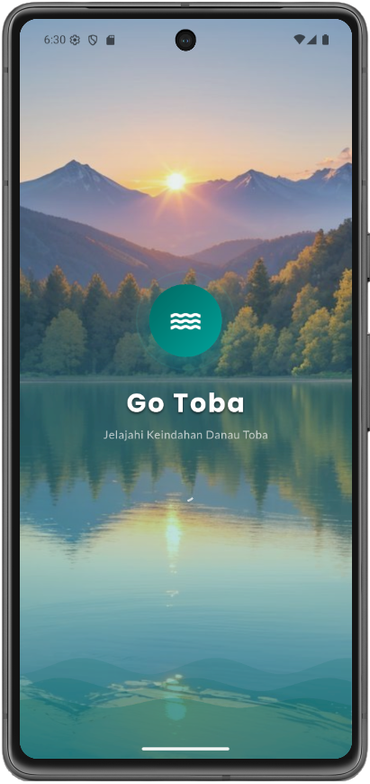
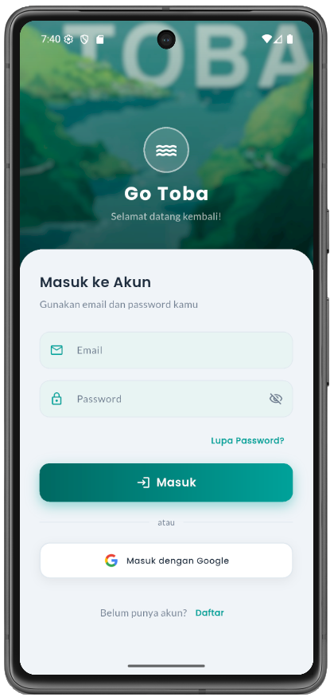
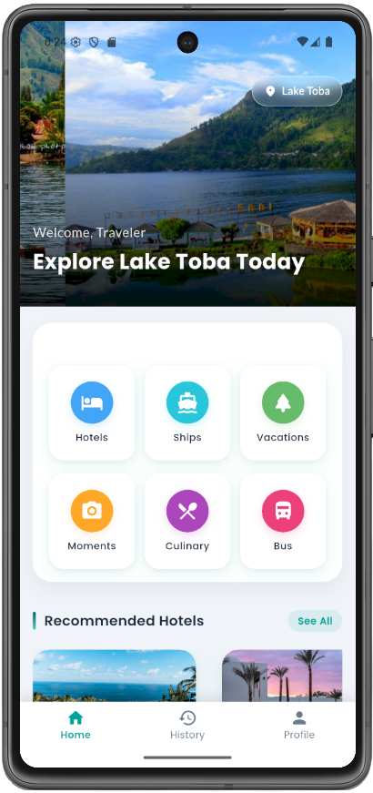
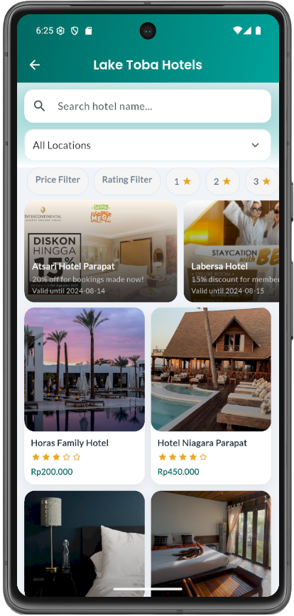
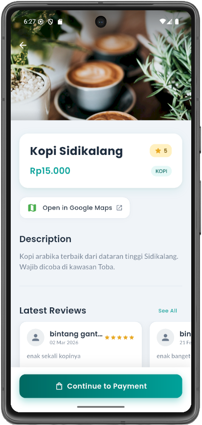
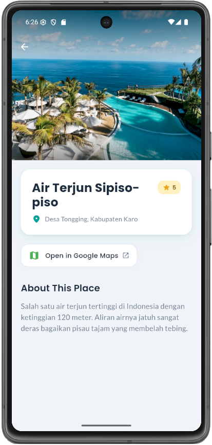
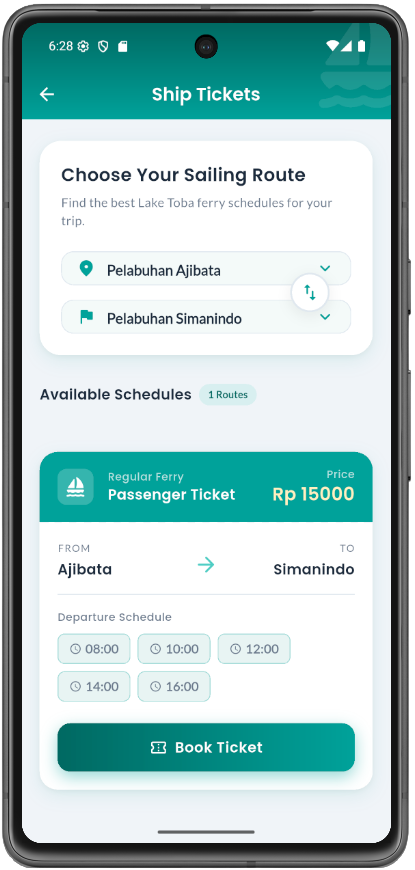

# Go Toba

<p align="center">
  
</p>

## Overview
Go Toba is a tourism and travel companion app focused on the Lake Toba area. The app combines trip discovery, transportation booking, accommodation booking, culinary exploration, social moments, and user history into one mobile experience.

## App Description
Go Toba helps travelers plan and enjoy their Lake Toba journey through six core modules:
- `Hotels`: browse hotels, apply filters, view room details, and book stays.
- `Ships`: search ferry routes and schedules, then book tickets.
- `Vacations`: discover destinations with category/tag filters and open map links.
- `Culinary`: explore local food spots, view reviews, and place orders.
- `Bus`: find bus routes and schedules, select passengers, and book tickets.
- `Moments`: create travel stories with captions and photos, then like/share posts.

The home page also provides personalized recommendations (hotels, destinations, and culinary) based on user preference tags collected from in-app interactions.

## Tech Features
- `Flutter + Dart` application architecture.
- `Firebase Core` initialization and cloud backend integration.
- `Firebase Authentication` for email/password and Google sign-in (plus Facebook auth integration in codebase).
- `Cloud Firestore` for content, bookings, histories, reviews, stories, and user data.
- `Firebase Storage` for profile photos and story image uploads.
- `Provider` for state management (user session/profile, navbar state, locale state).
- `Shared Preferences` for session persistence and saved language preference.
- `Localization (i18n)` with `flutter_localizations` and ARB-based strings (`English` and `Indonesian`).
- `Booking + payment flow` with virtual account generation, payment deadline handling, and pending-payment tracking.
- `Review system` tied to transaction history to prevent duplicate reviews.
- `Social sharing` via `share_plus`, with image download/caching support (`http`, `path_provider`) before sharing.
- `Media access` via `image_picker` and `permission_handler`.
- `Map deep linking` using `url_launcher` (Open in Google Maps).
- Reusable design system in `lib/style.dart` (color tokens, typography, gradients, reusable components).

## Screenshots
### Splash Screen


### Login


### Home


### Hotels


### Culinary Detail


### Destination Detail


### Ship Tickets


## Getting Started
### Prerequisites
- Flutter SDK `>=3.3.0 <4.0.0`
- A configured Firebase project for Android/iOS targets

### Run Locally
```bash
flutter pub get
flutter run
```

If Firebase is not configured yet, add your platform Firebase config files before running the app.
